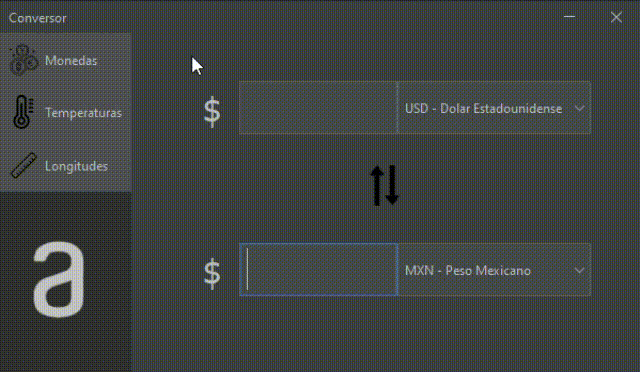

# ONE - Challenge Conversor

## Descripción

Este proyecto es parte del programa ONE en el que colaboran Oracle y Alura Latam, y es uno de los challenge del path de Backend. Consiste en un Conversor, originalmente de divisas, pero agregué también la capacidad de convertir longitudes y temperaturas.

Esta app fue desarrollada en Java y utilizando la biblioteca Swing para la creación de la interfaz gráfica.

## Instrucciones

- Si no se tiene instalado el [Java Runtime Environment (JRE)](https://www.java.com/es/download/ie_manual.jsp), descargar e instalar.
- Una vez descargado el proyecto, abra el archivo .jar Conversor - One, es el ejecutable del proyecto.

## Librerías Utilizadas

- [FlatLaf](https://github.com/JFormDesigner/FlatLaf)